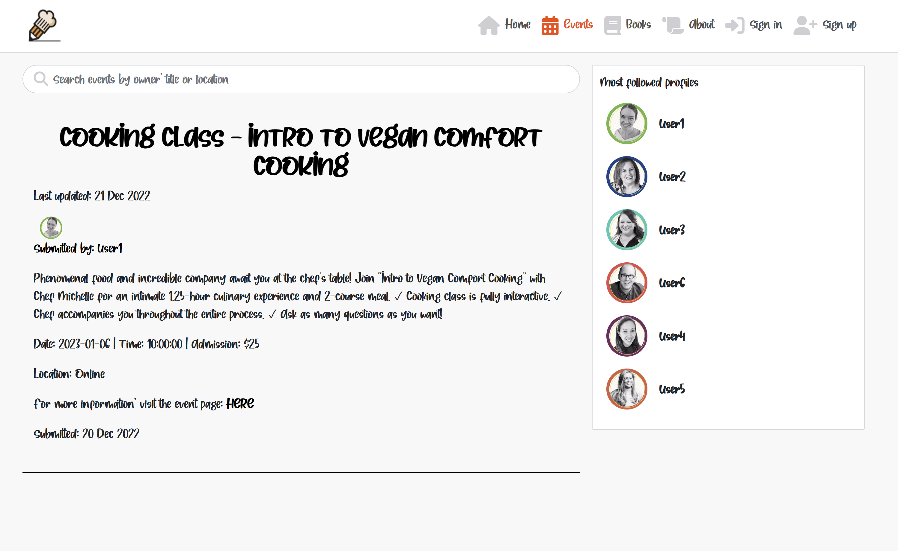
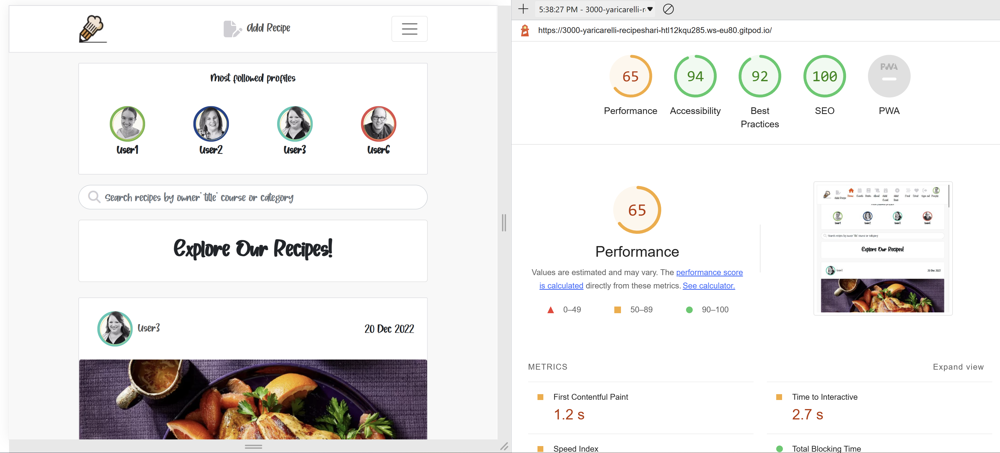
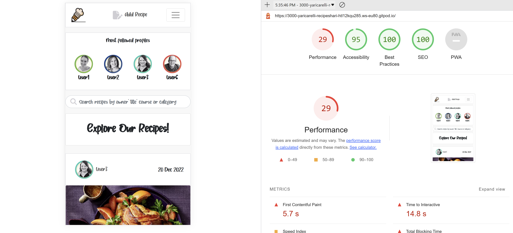

# Recipe Sharing Platform
Recipe Sharing Platform is a recipes & social media platform for home chefs and & food-lovers alike. Here, users can find recipes, along with upcoming cooking events both in their local cities and online, and find out about cookbooks suggested by other members of the community. Users are invited to interact with each other by sharing recipes, cookbooks and cooking experiences.
<br />

The repository for the DRF-API associated with this project is available [HERE](https://github.com/Yari-Carelli/Recipe-Sharing-Platform-DRF-API). The installation, set up, and deployment steps for this section of the project have also been included in the README linked to the DRF-API. 


#### DEPLOYED API HEROKU [LINK](https://recipe-sharing-platform-api.herokuapp.com/)
#### DEPLOYED FRONTEND HEROKU [LINK - LIVE SITE](https://recipe-sharing-platform-yc.herokuapp.com/)
#### DEPLOYED BACKEND GITHUB [REPOSITORY](https://github.com/Yari-Carelli/Recipe-Sharing-Platform-DRF-API)


## Table of Contents
+ [UX](#ux "UX")
  + [Site Purpose](#site-purpose "Site Purpose")l
  + [Site Goal](#site-goal "Site Goal")
  + [Audience](#audience "Audience")
  + [Communication](#communication "Communication")
  + [Current User Goals](#current-user-goals "Current User Goals")
  + [New User Goals](#new-user-goals "New User Goals")
+ [Design](#design "Design")
  + [Colour Scheme](#colour-scheme "Colour Scheme")
  + [Typography](#typography "Typography")
  + [Wireframes](#imagery "Wireframes")
+ [User Stories](#user-stories "User Stories")
+ [Features](#features "Features")
  + [Existing Features](#existing-features "Existing Features")
  + [C.R.U.D](#crud "C.R.U.D")
+ [Testing](#testing "Testing")
  + [Validator Testing](#validator-testing "Validator Testing")
+ [Technologies Used](#technologies-used "Technologies Used")
  + [Main Languages Used](#main-languages-used "Main Languages Used")
  + [Frameworks, Libraries & Programs Used](#frameworks-libraries-programs-used "Frameworks, Libraries & Programs Used")
+ [Components](#oomponents "Components")
+ [Deployment](#deployment "Deployment")
+ [Credits](#credits "Credits")
  + [Content](#content "Content")
  + [Media](#media "Media")
<br />

## UX

### Site Purpose:
To bring interactivity to the culinary community by sharing the recipes, cooking events, cookbooks, and feedback from other cooking enthusiasts.

### Site Goal:
Recipe Sharing Platform is intended to create an online recipe archive built upon the home recipes shared by the community, as well as bring people together by suggesting cooking experiences and cookbooks with each other.

### Audience:
Everyone with an interest in cooking, and the desire to reach out & connect with like-minded individuals.

### Communication:
The layout is intended to represent a basic social platform, whilst at the same time having a playful, interactive feel to it. With the navigation panel being present at all times, the users can quickly navigate through the site to arrive at their intended destination.

### Current User Goals:
To keep users coming back again and again to see what is new in terms of recipes, events, and books, as well as to follow up with other users that they follow.

### New User Goals:
To engage the user in a meaningful way, and encourage them to explore everything that the site has to offer.

### Future Goals:
- To provide different types of user accounts, so that access is restricted for who may publish specific types of content.
- Provide the ability for users to send private messages to either another user, or a group of users.
- To expand the events section and provide a google maps location for each event, so that users may understand in more detail where an event is to be hosted.
<br />

## Design

### Colour Scheme:


### Typography:
The following font has been downloaded and used for the entire project: [Font](https://www.dafont.com/wild-hazelnut.font)
<br />

## User Stories
I have included links to the [GitHub Issues](https://github.com/Yari-Carelli/recipe-sharing-platform/issues) for this project, as well as the [KANBAN board](https://github.com/users/Yari-Carelli/projects/16).

A full list of the User Stories typed up can be also found here [HERE](src/assets/UserStories.md).
<br />

# Features

### Existing Features:

#### Navigation Bar - Desktop:


#### Navigation Bar - Desktop:


##### Navigation Bar - Mobile:


##### Homepage:


##### Search Bar:


#### About Page:


#### Events Page:



#### Submission Form:


#### Popular Profiles:


#### Social Links:


##### Sign-in Page:


##### Sign-up Page:


##### Comment Form:


### Features to Implement:
- The ability to like events and books.
- The ability to leave comments on events and books.
- Notifications when a user receives a new follower, comment, or like.
- Subscription to newsletter
- Email notification when a new recipe has been posted on the platform.
- Private messaging between users.
- Group messaging between users.
- Restrict profile and posts views to only an approved list of users, should a user wish.
- A contact form so that users can provide feedback.
<br />

## Testing

### Manual Testing:

- CRUD functionality has been tested for each of the following: Posts | Books | Events | Comments | Likes | Follow | Profile
 - Likes & Follow may only be created & deleted
 - Profile may only be updated
- All nav links open to the correct page.
- All external links open to a new browser window.
- Pages intended for logged-in users (e.g. feed and liked) only will redirect logged-out users back to the home page.
- Dropdown menu to allow users to edit/delete content only appears on content that they have created.
- Users are able to register a new account.
- Users with an existing account are able to sign in.
- Each user has the ability to sign out.

### Validator Testing
1. CSS files vave been validated by direct input and passed through the [Jigsaw validator](https://jigsaw.w3.org/css-validator/) with no issues found.


2. a. Javascript files pass through [ESLint](https://eslint.org/). The following issues were raised, and have been intentionally ignored as they are in relation to code that was provided in the Moments Walkthrough project:
 - Props spreading is forbidden
 - Do not pass children as props. 
 - Do not use Array index in keys
 - 'a_name' is already declared in the upper scope
 - Expected an assignment or function call and instead saw an expression
 - Do not nest ternary expressions
 - Fragments should contain more than one child
2. b. All `console.log(err);` have been left in place and commented out, as it was suggested that this is also done in real-world scenarios.
2. c. Added all files affected by the above, unresolved warnings to `.eslintignore`, as well as added the following line to the top of each individual file, `/* eslint-disable */` to allow for a successful deployment on Heroku.

3. The page has an excellent Accessibility rating in Lighthouse:




4. Tested the site opens in Brave, Chrome, Safari & on a mobile device without issues.

5. All social links open to external pages as intended.
<br />

## Technologies Used
### Main Languages Used
- HTML5
- CSS3
- Javascript
- Python
- ElephantSQL

### Frameworks, Libraries & Programs Used
- Font Awesome : To add icons to the social links in the footer & navigation sections.
- GitPod : To build the project & create the JSX & CSS files before pushing the project to Github.
- GitHub : To store my repository for submission.
- Balsamiq : Was used to create mockups of the project prior to starting.
- Am I Responsive? : To ensure the project looked good across all devices.
- Django : Used to build the backend database that serves as an API for the front-end project.
- React-Bootstrap : The styling library that has aided to the layout of the site, and which was introduced to us during the course of the program.
- DrawSQL : An interactive tool that allows for the creation of Database mock-ups so that we can visualise the relationships between models.
- ReactJS : To build the components that would collectively form the front-end application.
<br />

## Components
Several components have been implemented within this project that have been reused throughout the project:
1. axiosDefault.js : for ease of communication with the backend API.
2. Asset.js : to supply the loading spinner & user avatar throughout the site.
3. MoreDropdown.js : to allow users to edit/delete their Posts, Events & Books.
4. CurrentUserContext.js : confirm users logged-in status to determine what functionality is available to that user.
5. ProfileDataContext.js : provide un/follow ability to other users across PopProf & ProfPage components.
6. useClickOutsideToggle.js : whilst this component has only been applied to the NavBar, it could in theory be applied to additional dropdown menus installed into the site in the future to allow for the automatic collapse of an element upon mouse click.
7. useRedirect.js : redirects a user to another page if they are not authorised to be on the page they are trying to access.
8. utils.js : supplies functionality to all of the components that utilise the Infinite Scroll.

## Deployment
The site was deployed to Heroku. The steps to deploy are as follows:
1. Launch the gitpod workspace.
2. Install ReactJS:
```
npx create-react-app . --use-npm
npm start
```
2. Install the following packages using the command `npm install`:
```
react-bootstrap@1.6.3 bootstrap@4.6.0
react-router-dom@5.3.0
axios
react-infinite-scroll-component
msw --save-dev
jwt-decode
-g eslint
```
3. Git add, commit, and push changes to gitpod.
4. Create the project app on Heroku, and link the GitHub repository by navigating to the 'Deploy' tab.

### Connecting to the API:
1. Navigated to the Heroku app of the project DRF-API, and under the Settings tab, added the following configvars:
- Key: CLIENT_ORIGIN | Value: https://react-app-name.herokuapp.com
- Key: CLIENT_ORIGIN_DEV | Value: https://gitpod-browser-link.ws-eu54.gitpod.io
2. Check that the trailing slash `\` at the end of both links has been removed, and save the configvar pairs.
3. Install the Axios package, & create supporting `axiosDefaults.js` as shown in [Moments Walkthrough](https://github.com/Code-Institute-Solutions/moments/blob/cf955d2f2e6f70f61c92d1f9de85558d8e49f3a8/src/api/axiosDefaults.js).

### Deploy to Heroku:
1. In the `scripts` section of `package.json` in gitpod, added the following command:
```
"heroku-prebuild": "npm install -g serve",
```
2. Add Procfile to project root & populate with the following:
```
web: serve -s build
```
3. Repeat the steps of git add/commit/push.
4. Deploy the project via the deploy button on Heroku.
<br />

## Credits

### Content
- Code Institute: The creation of the project came to life by utilising the Moments walkthrough step-by-step as a base foundation, and then building upon it to make the project my own. This is evident from the numerous docstrings within my files crediting the walkthrough.
- [Martina Terlevic](https://github.com/SephTheOverwitch): A constant support system, providing reassurance, and the ability to calm me down.

### Media
- All the images on the site have been accumulated from different sources on the Internet. I do not have the information of the original content creator for these memes.